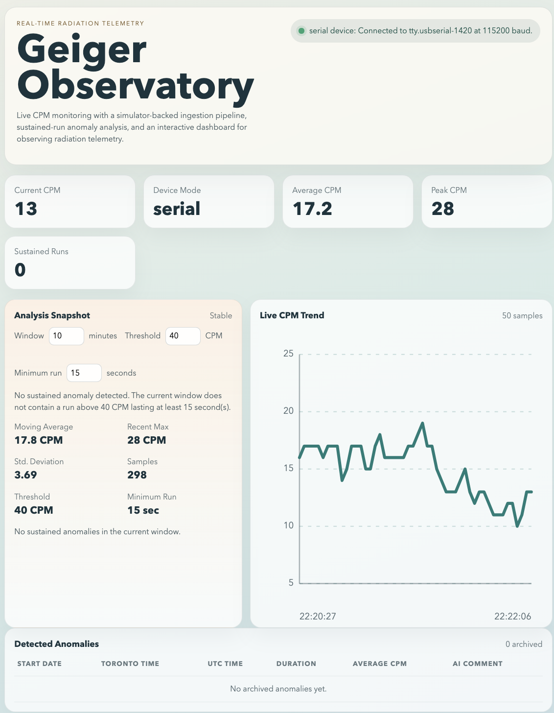

# Geiger Observatory

Geiger Observatory is a full-stack telemetry dashboard for collecting, analyzing, and visualizing radiation measurements from a Geiger counter.

The backend ingests counts-per-minute (CPM) readings from either a simulator or a USB serial device, exposes live and historical APIs, and performs threshold-based anomaly detection. The frontend renders a live dashboard with connection status, current CPM, interactive charting, anomaly controls, and a persisted anomaly log.



## Purpose

This project focuses on:

- Spring Boot for real-time ingestion, REST APIs, SSE streaming, configuration, and service design.
- React for asynchronous data fetching, live updates, stateful UI, and dashboard composition.
- Hardware integration via a serial USB device.
- A simulator-backed runtime path so the system remains runnable without the physical device.

## What it does

- Polls a Geiger counter for CPM readings over USB serial.
- Falls back to simulator mode so the project is runnable without hardware.
- Streams live readings to the frontend with Server-Sent Events.
- Keeps recent readings in memory for historical views.
- Detects sustained CPM runs above a configurable threshold.
- Persists detected anomalies to PostgreSQL with a placeholder AI comment field.
- Supports a simulator-only forced anomaly mode for end-to-end archive testing.
- Exposes device connection state so the UI can show whether live hardware is available.

## Stack

- Backend: Java 21, Spring Boot, Maven, jSerialComm, Spring Data JPA
- Frontend: React, TypeScript, Vite
- Database: PostgreSQL
- Transport: REST + Server-Sent Events
- Containers: Docker Compose for local PostgreSQL

## Architecture

- `backend/`
  - `device/`: simulator and serial implementations behind a shared `ReadingDevice` interface
  - `ingest/`: polling, in-memory reading retention, live event publishing, anomaly archiving
  - `analysis/`: sustained-run detection and anomaly archive coordination
  - `persistence/`: PostgreSQL anomaly entities and repositories
  - `api/`: REST and SSE endpoints
- `frontend/`
  - React dashboard for status, metrics, live charting, and archived anomaly review

Backend component diagram: [`backend/docs/backend-components.md`](backend/docs/backend-components.md)

## Demo modes

### Simulator mode

Default mode. Generates synthetic CPM data with noise and occasional spikes so anyone can run the project locally.

It also supports an optional forced anomaly window for testing PostgreSQL capture without the physical device.

### Serial mode

Uses the Geiger counter protocol from an earlier Java experiment:

- command written to device: `<GETCPM>>`
- response: 2 bytes representing CPM
- baud rate: `115200`

## API

- `GET /api/health`
- `GET /api/readings?limit=50`
- `GET /api/readings/summary`
- `GET /api/readings/analysis`
- `GET /api/readings/anomalies`
- `GET /api/readings/device`
- `GET /api/readings/stream`

`GET /api/readings/analysis` accepts:

- `windowMinutes`
- `thresholdCpm`
- `minDurationSeconds`

## Running locally

### PostgreSQL

From the repo root:

```bash
docker compose up -d postgres
```

### Backend

```bash
cd backend
mvn spring-boot:run
```

### Frontend

```bash
cd frontend
npm install
npm run dev
```

- Backend: `http://localhost:8080`
- Frontend: `http://localhost:5173`

The backend expects PostgreSQL on `localhost:5432` by default.

## Switching to the real device

The app runs in simulator mode by default. To switch to the Geiger counter, edit `backend/src/main/resources/application.yml`:

- set `app.device.mode: serial`
- set `app.device.comm-port` to your local serial device name
- set `app.device.test-anomaly-enabled: false`
- keep `app.device.command: "<GETCPM>>"` unless your device protocol differs

The backend will then poll the serial device and expose its connection state through `GET /api/readings/device`, which the React dashboard shows in the header.

## Testing anomaly persistence

If you want to exercise PostgreSQL anomaly capture without the physical device, enable the simulator's forced anomaly window in `backend/src/main/resources/application.yml`:

- set `app.device.test-anomaly-enabled: true`
- keep `app.device.mode: simulator`
- start PostgreSQL with `docker compose up -d postgres`
- start the backend and wait for the forced run to complete

With the default settings, the simulator produces a sustained `48 CPM` run starting after `10` readings and lasting `70` readings. At the default `2000 ms` polling interval, that means the anomaly starts about `20 seconds` after backend startup and lasts about `140 seconds`, which is long enough to satisfy the default archive rule of `40 CPM` for `15 seconds`.

## Current UI

The React dashboard currently includes:

- current CPM, average CPM, peak CPM, and sustained-run metrics
- adjustable live analysis controls for window, threshold, and minimum run in seconds
- an interactive live CPM chart with axes, guide lines, hover crosshair, and tooltip
- a persisted anomaly table with Toronto local time, UTC time, duration, average CPM, and AI comment

## Current limitations

- Readings are stored in memory, while anomalies are persisted to PostgreSQL.
- Anomaly detection is intentionally simple threshold-run logic.
- The AI comment field is stored but not populated yet.
- Serial device handling is polling-based and assumes a 2-byte CPM response.
- There is no authentication or multi-user support.

## Roadmap

- Persist raw readings to PostgreSQL or TimescaleDB.
- Add export to CSV.
- Add richer device diagnostics and reconnect behavior.
- Populate archived anomalies with AI-generated comments.
- Add tests around serial parsing and anomaly detection.

## System Characteristics

The current system covers a realistic end-to-end telemetry flow:

- hardware input
- backend ingestion and live APIs
- frontend visualization
- observability-style metrics
- clear room for production-oriented extensions
