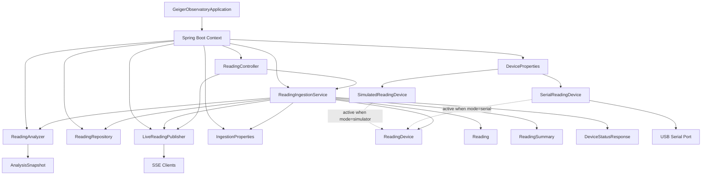

# Backend Components

```mermaid
flowchart TD
    A[GeigerObservatoryApplication] --> B[Spring Boot Context]
    B --> C[ReadingController]
    B --> D[ReadingIngestionService]
    B --> E[ReadingAnalyzer]
    B --> F[ReadingRepository]
    B --> G[LiveReadingPublisher]
    B --> H[DeviceProperties]
    B --> I[IngestionProperties]

    H --> J[SimulatedReadingDevice]
    H --> K[SerialReadingDevice]

    J -. active when mode=simulator .-> L[ReadingDevice]
    K -. active when mode=serial .-> L

    D --> L
    D --> E
    D --> F
    D --> G
    D --> I

    C --> D
    C --> G

    D --> M[Reading]
    E --> N[AnalysisSnapshot]
    D --> O[ReadingSummary]
    D --> P[DeviceStatusResponse]

    K --> Q[USB Serial Port]
    G --> R[SSE Clients]
```
